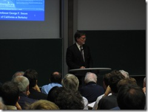
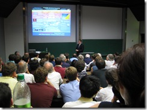

今天下午，在[Garching校区](http://maps.google.com/?ie=UTF8&ll=48.265298,11.672459&spn=0.009956,0.021372&t=h&z=16)物理系，听[George Smoot](http://en.wikipedia.org/wiki/George_Smoot)教授做了一场报告，半小时前刚刚从Garching回到了办公室。

George Smoot是加州大学伯克利分校的物理教授，因发现了“宇宙微波背景辐射的黑体形式和各向异性”（blackbody form and anisotropy of the cosmic microwave background radiation，不知道是不是这么翻译）而获得了2006年的诺贝物理奖。虽然这次终于不再是德语报告，而且是更容易懂的美国英语，但还是听得我晕晕乎乎。也难怪，人家是搞天体物理的，我是搞……对呀，我是搞啥的？通信？软件？数据库？GIS？遥感？交通？制图？似乎都是，又似乎都不是……不过，我想说的是，隔行如隔山。

 

现在能回忆起Smoot教授报告中的东西，好像也就是这么几个：

**印象一**

宇宙中所占比例最大的是“暗能量”（Dark Energy），而不是我原来一直以为的“暗物质”（Dark Matter），暗物质的比重要小于暗能量。（不要深究，我不懂）

**印象二**

他幻灯片中的三维可视化做的很漂亮，尤其是不同尺度的宇宙，看起来比较热闹。

**印象三**

Smoot教授用的是苹果的笔记本。

 

是不是很没前途的三个印象？没关系，反正“我这辈子，要说得个诺贝尔奖，估计是够呛”，画外音：“甭够呛，压根就没戏。”（注1）

 

注1：改自《黑社会》，郭德纲，于谦
