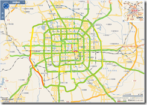
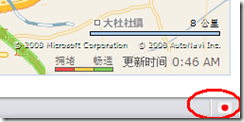

昨天，微软[Live Maps中国](http://ditu.live.com/)进行了一次较大更新，为北京市增加了实时交通信息，并且支持将该信息免费发送至用户手机。其实准确的说，应该是将实时交通信息集成了进来，这些信息早就有，而且[北京公众出行网](http://210.73.83.233:8080/ITSWeb/jamindex.jsp)和作为Google Maps中国数据源的[Mapabc](http://www.mapabc.com/lukuang/beijinglukuang.html)上也都有，所以说如果Google也要发布此类信息，应该不难。

除此以外，微软还更新了一些城市的街道图和公交信息，另外增加了一些新建的地铁线。

消息来源：[Virtual Earth/Live Maps-\>Live Maps updated in China](http://virtualearth.spaces.live.com/Blog/cns%212BBC66E99FDCDB98%2119352.entry)

我想，这应该是[Live Maps在成为央视奥运合作伙伴](http://www.cnblogs.com/rib06/archive/2008/06/22/1227493.html)之后推出的一项重要服务，动作很快，挺好。Live Maps在国外很多大城市（包括东京、慕尼黑等等）都还没有提供这项服务。另外，还有个小发现，FireFox3的Geotool小工具显示，Live Maps中国的服务器在日本东京（[详细](http://geotool.servehttp.com/?ip=202.89.238.252&host=ditu.live.com)），如果你早就知道了，也不用拍我，我确实是刚发现。

