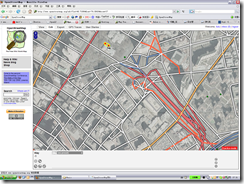

[OpenStreetMap](http://www.openstreetmap.org/index.html)如今已经越来越成熟了，不仅体现在他的数据越来越丰富，而且基于他的应用也越来越多，这说明OSM数据的可用性越来越强。今年5月份，波恩大学制图系就做出了一个基于OSM数据和OGC标准OpenLS接口的路径规划服务[OpenRouteService](http://www.openrouteservice.org/)。这个系统是一个叫[Pascal Neis](http://www2.geoinform.fh-mainz.de/%7Eneis/)的德国小伙子为主做的，他是FH-Mainz毕业的Diploma（大约相当于国内的硕士），现在在波恩大学制图系读Alexander Zipf教授的博士。在德国，学校名字前面加FH大约相当于我们国内的大专或者是高等专科学校。别看人家是FH毕业的，能力还不赖。如果有兴趣，又懂德语，可以到他主页上看看，上面还有他的毕业论文。目前，OpenRouteService提供包括慕尼黑在内的德国13个城市的路径规划服务，正是由于基于OSM翔实的数据，OpenRouteService才能够提供步行者路径规划，这就是他不同于其他路径规划系统的地方。Google Maps现在还做不到这个程度，因为Google Maps的矢量数据是由Navteq和TeleAtlas提供的，而NA和TA两家公司都只做汽车导航数据，自然不会有人行道数据。

  OSM的蓬勃发展说明了wiki风格的制图有搞头。OSM的矢量数据主要靠来自全球各地的爱好者和热心人们在Yahoo Maps提供的影像数据基础上半自动数字化得来的（图1），再加上一些有GPS接收机的人上传的一些GPS轨迹图，再加上使用像[JOSM](http://wiki.openstreetmap.org/index.php/JOSM)这种稍微高级一点的地图编辑器的制图人员的绘制与修正。前面说了，OSM的优势在于翔实，地铁线、公交线、人行道以及越来越多的包括邮局、交通灯、教堂、停车场等POI信息都已经能在OSM的很多城市图里看到了，比如[这里](http://www.openstreetmap.org/?lat=48.14479&lon=11.58588&zoom=15&layers=B00FT)就是慕尼黑市中心和英国公园的一部分，能够看到在英国公园里详细的人行道，而这些在[Google的数据](http://maps.google.com/maps/mm?ie=UTF8&hl=zh-CN&ll=48.147649,11.587358&spn=0.020588,0.042744&z=15)里面是完全没有的。另外，OSM支持数据导出，除了标准的图像格式以外，以.osm为后缀的xml格式对我最有吸引力，因为我认为这是最有希望把GDF枪毙掉的格式的雏形，[我前面说过了，我很烦GDF](http://www.cnblogs.com/rib06/archive/2008/04/10/1145934.html)，而且在我参与写完Shapefile-GDF转换程序之后，越发的感觉GDF是一种不伦不类的格式，实在是应该被枪毙掉。

图1 OSM的编辑界面

 

p.s. OpenRouteService还在不断的完善，这两天又新增加了Accessibility Analyse功能，它可以帮你算出从一个点出发，在xx分钟之内你能到达的地区范围。
