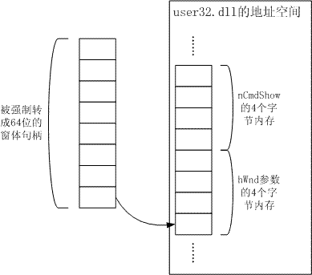

今天解决了一个关于平台调用的小问题，让本次郁闷之旅闪过一丝微光。

      **问题**\
    在我们的程序中控制另外一个独立运行的程序。为了方便起见，我们的程序就叫master，那个受控的程序就叫servant。master要做的事情是：看servant是否已经运行，如果没有运行，则运行servant，如果已经运行，则把它还原并调到前台——就这俩事儿。

      **思路**\
    判断好办，获取进程列表，判断一下是否存在servant进程就可以。第一件事也好办，用Shell函数直接执行servant.exe就可以，并且还可以得到servant的进程ID。但是第二个就麻烦一点了，翻腾了一下MSDN，没找到如果进程已经运行，怎么让它还原到前台的.net方法。所以决定借用Win32API，里面有个ShowWindow好像很符合我的需求。\
    ShowWindow的原型说明如下：\

The ShowWindow function sets the specified window's show state.\
BOOL ShowWindow(         \
    HWND hWnd,\
    int nCmdShow\
);

\
    参数很少，也很简单，还都是输入参数，比我封装过的那些有字符串，又有结构体，还有包含字符串和结构体指针的结构体的指针（p.s.没写错，SDE API里面这样的函数遍地都是）等等变态参数仁慈多了。\
    hWnd是窗体句柄，一个32位整型值。nCmdShow是控制窗体风格的一组常量：SW_FORCEMINIMIZE，SW_HIDE，SW_MAXIMIZE，SW_MINIMIZE，SW_RESTORE，SW_SHOW，SW_SHOWDEFAULT，SW_SHOWMAXIMIZED，SW_SHOWMINIMIZED，SW_SHOWMINNOACTIVE，SW_SHOWNA，SW_SHOWNOACTIVATE，SW_SHOWNORMAL。从名字也能大概猜出这些常量的含义。\
    第一个窗体句柄参数在.net里面可以通过Process.GetProcessById(id).MainWindowHandle得到，里面的进程id用前面说的Shell方法可以得到，MainWindowHandle属性是一个IntPtr类型，也没什么问题。\
    第二个参数各个常量的定义在WinUser.h里面，对应的具体数值为：\
 

/\*\
 \* ShowWindow() Commands\
 \*/\
\#define SW_HIDE             0\
\#define SW_SHOWNORMAL       1\
\#define SW_NORMAL           1\
\#define SW_SHOWMINIMIZED    2\
\#define SW_SHOWMAXIMIZED    3\
\#define SW_MAXIMIZE         3\
\#define SW_SHOWNOACTIVATE   4\
\#define SW_SHOW             5\
\#define SW_MINIMIZE         6\
\#define SW_SHOWMINNOACTIVE  7\
\#define SW_SHOWNA           8\
\#define SW_RESTORE          9\
\#define SW_SHOWDEFAULT      10\
\#define SW_FORCEMINIMIZE    11\
\#define SW_MAX              11

\
    我要的应该就是SW_SHOWNORMAL/SW_NORMAL对应的1。\
    这样，两个参数的输入值都搞定了，下面只要能在.net里面把这个API声明出来就可以了。  

      **实施**\
    在vb.net中声明ShowWindow函数原型如下：

Declare Auto Function ShowWindow()

Function ShowWindow Lib "user32.dll" (ByVal hWnd As Long, ByVal nCmdShow As Long) As Long

    然后在程序中写代码：

Dim procid As Integer = Shell("servant.exe", AppWinStyle.NormalFocus)\
Dim servantWindowHandle As Long = Process.GetProcessById(procid).MainWindowHandle.ToInt64\
Dim result As Long = ShowWindow(servantWindowHandle, 1)\
Debug.WriteLine(result.ToString())\

    结果却是……

      **“异常”\**
    打上引号是因为根本就没有抛出什么异常，但是明明给第二个参数传入的是1，也就是SHOWNORMAL，但每次运行的结果却都是窗口直接被干掉了！只留下一个自己的尸体漂在进程列表里。而且无论我给第二个参数传几，结果都是一样，都相当于给第二个参数传入0（SW_HIDE）。调试输出的result值也是怪异的8976496028190507024这种数字。哪里出问题了？

      **Debug**\
    nnd，就这么几句话也写不对？API应该是没有用错，跟踪监视procid变量的值也是对的。问题的焦点落在了ShowWindow的声明上，我下意识的把函数重新声明成下面的样子：

Declare Auto Function ShowWindow()

Function ShowWindow Lib "user32.dll" (ByVal hWnd As Integer, ByVal nCmdShow As Integer) As Integer

    相应的，后面也改成

Dim procid As Integer = Shell("servant.exe", AppWinStyle.NormalFocus)\
Dim servantWindowHandle As Integer = Process.GetProcessById(procid).MainWindowHandle.ToInt32\
Dim result As Integer = ShowWindow(servantWindowHandle, 1)\
Debug.WriteLine(result.ToString())

    呵呵，这样居然就行了。窗口老老实实的秀出来了。

      **真相**\
    平台调用里面最麻烦也是最重要的就是内存对齐，对不齐内存很多时候连异常也没有，直接就是错误结果。经常是查了很久也找不到问题，就算判断到了是哪个参数写的不对，也很难写出对的声明，我曾经试图用c#封装ArcSDE C API，但是现在还是有几个函数怎么也搞不定。\
    在这个程序中，窗体句柄是32位整型值，而在.net中，Long变长了，成了64位的。所以在第一种声明方式下，一个Process.GetProcessById(procid).MainWindowHandle得到的32位句柄被强行延拓成了64位的，也就是把全0值补给了它的高32位，然后传入ShowWindow，然而请注意，原始的ShowWindow函数需要的是两个32位的整型参数，现在传个窗体句柄就一下子塞进去64位，内存栈里面留给这两个参数的地方就全被这个句柄值占满了。而被强行伸长的64位句柄的低32位确是真实的句柄值，也歪打正着的填在了本来应该接受句柄参数的内存区域，但高32位，也就是0，同样没有任何理由的占到了nCmdShow参数的位置上。这样就导致了每次传入64位窗体句柄参数的同时，也给nCmdShow参数强制传入了0。这就是为什么在第一种声明方式下，无论给nCmdShow传入什么参数，ShowWindow的动作都是隐藏窗体的原因所在。\
\
\
\
\
    仅有的一丝略带创造性的微光渐渐消失了，周围又变成了一片黑暗，由2个博士和3个硕士组成的IT民工们继续在泥坑中挣扎，还不知要挨多久。

\
